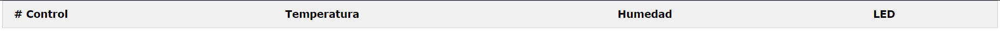

# ServerNodeJS
Servidor, página, código de Arduino para ESP32 y un css opcional.


# Práctica 3

Con esto ya jala todo el asunto. Cambien la IP a la correspondiente de su laptop.

## ¿No sabes tu  IP?

Corre esto en el CMD.

```bash
  ipconfig
```
Y seleccionas la IPv4.

## Instalación

Para usar correctamente este server, se debe usar Node. Modifique las líneas de código que tengan que ver con su IP, una vez hecho eso abres la terminal en el folder en el que se descargó esto y pones:


```bash
  npm install socket.io@1.7.2
  npm start
```

En un buscador pones tu IP y listo:


